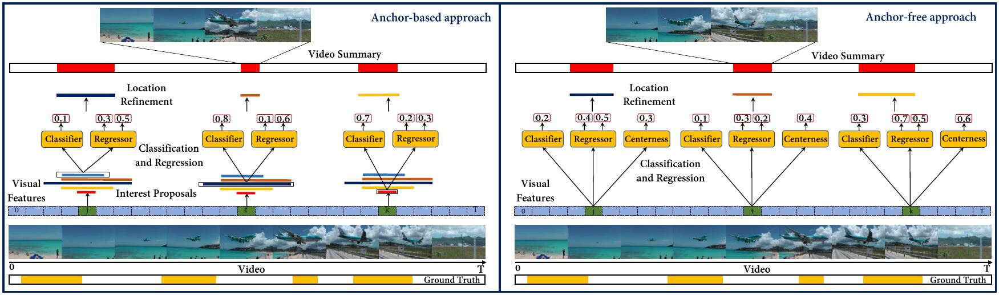

# DSNet: A Flexible Detect-to-Summarize Network for Video Summarization [[paper]](https://ieeexplore.ieee.org/document/9275314)

[](https://github.com/li-plus/DSNet/actions)
[](https://github.com/li-plus/DSNet/blob/main/LICENSE)



A PyTorch implementation of our paper [DSNet: A Flexible Detect-to-Summarize Network for Video Summarization](https://ieeexplore.ieee.org/document/9275314) by [Wencheng Zhu](https://woshiwencheng.github.io/), [Jiwen Lu](http://ivg.au.tsinghua.edu.cn/Jiwen_Lu/), [Jiahao Li](https://github.com/li-plus), and [Jie Zhou](http://www.au.tsinghua.edu.cn/info/1078/1635.htm). Published in [IEEE Transactions on Image Processing](https://ieeexplore.ieee.org/xpl/RecentIssue.jsp?punumber=83).

## Getting Started

This project is developed on Ubuntu 16.04 with CUDA 9.0.176.

First, clone this project to your local environment.

```sh
git clone https://github.com/li-plus/DSNet.git
```

Create a virtual environment with python 3.6, preferably using [Anaconda](https://www.anaconda.com/).

```sh
conda create --name dsnet python=3.6
conda activate dsnet
```

Install python dependencies.

```sh
pip install -r requirements.txt
```

## Datasets Preparation

Download the pre-processed datasets into `datasets/` folder, including [TVSum](https://github.com/yalesong/tvsum), [SumMe](https://gyglim.github.io/me/vsum/index.html), [OVP](https://sites.google.com/site/vsummsite/download), and [YouTube](https://sites.google.com/site/vsummsite/download) datasets.

```sh
mkdir -p datasets/ && cd datasets/
wget https://www.dropbox.com/s/tdknvkpz1jp6iuz/dsnet_datasets.zip
unzip dsnet_datasets.zip
```

If the Dropbox link is unavailable to you, try downloading from below links.

+ (Baidu Cloud) Link: https://pan.baidu.com/s/1LUK2aZzLvgNwbK07BUAQRQ Extraction Code: x09b
+ (Google Drive) https://drive.google.com/file/d/11ulsvk1MZI7iDqymw9cfL7csAYS0cDYH/view?usp=sharing

Now the datasets structure should look like

```
DSNet
└── datasets/
    ├── eccv16_dataset_ovp_google_pool5.h5
    ├── eccv16_dataset_summe_google_pool5.h5
    ├── eccv16_dataset_tvsum_google_pool5.h5
    ├── eccv16_dataset_youtube_google_pool5.h5
    └── readme.txt
```

## Pre-trained Models

Our pre-trained models are now available online. You may download them for evaluation, or you may skip this section and train a new one from scratch.

```sh
mkdir -p models && cd models
# anchor-based model
wget https://www.dropbox.com/s/0jwn4c1ccjjysrz/pretrain_ab_basic.zip
unzip pretrain_ab_basic.zip
# anchor-free model
wget https://www.dropbox.com/s/2hjngmb0f97nxj0/pretrain_af_basic.zip
unzip pretrain_af_basic.zip
```

To evaluate our pre-trained models, type:

```sh
# evaluate anchor-based model
python evaluate.py anchor-based --model-dir ../models/pretrain_ab_basic/ --splits ../splits/tvsum.yml ../splits/summe.yml
# evaluate anchor-free model
python evaluate.py anchor-free --model-dir ../models/pretrain_af_basic/ --splits ../splits/tvsum.yml ../splits/summe.yml --nms-thresh 0.4
```

If everything works fine, you will get similar F-score results as follows.

|              | TVSum | SumMe |
| ------------ | ----- | ----- |
| Anchor-based | 62.05 | 50.19 |
| Anchor-free  | 61.86 | 51.18 |

## Training

### Anchor-based

To train anchor-based attention model on TVSum and SumMe datasets with canonical settings, run

```sh
python train.py anchor-based --model-dir ../models/ab_basic --splits ../splits/tvsum.yml ../splits/summe.yml
```

To train on augmented and transfer datasets, run

```sh
python train.py anchor-based --model-dir ../models/ab_tvsum_aug/ --splits ../splits/tvsum_aug.yml
python train.py anchor-based --model-dir ../models/ab_summe_aug/ --splits ../splits/summe_aug.yml
python train.py anchor-based --model-dir ../models/ab_tvsum_trans/ --splits ../splits/tvsum_trans.yml
python train.py anchor-based --model-dir ../models/ab_summe_trans/ --splits ../splits/summe_trans.yml
```

To train with LSTM, Bi-LSTM or GCN feature extractor, specify the `--base-model` argument as `lstm`, `bilstm`, or `gcn`. For example,

```sh
python train.py anchor-based --model-dir ../models/ab_basic --splits ../splits/tvsum.yml ../splits/summe.yml --base-model lstm
```

### Anchor-free

Much similar to anchor-based models, to train on canonical TVSum and SumMe, run

```sh
python train.py anchor-free --model-dir ../models/af_basic --splits ../splits/tvsum.yml ../splits/summe.yml --nms-thresh 0.4
```

Note that NMS threshold is set to 0.4 for anchor-free models.

## Evaluation

To evaluate your anchor-based models, run

```sh
python evaluate.py anchor-based --model-dir ../models/ab_basic/ --splits ../splits/tvsum.yml ../splits/summe.yml
```

For anchor-free models, remember to specify NMS threshold as 0.4.

```sh
python evaluate.py anchor-free --model-dir ../models/af_basic/ --splits ../splits/tvsum.yml ../splits/summe.yml --nms-thresh 0.4
```

## Generating Shots with KTS

Based on the public datasets provided by [DR-DSN](https://github.com/KaiyangZhou/pytorch-vsumm-reinforce), we apply [KTS](https://github.com/pathak22/videoseg/tree/master/lib/kts) algorithm to generate video shots for OVP and YouTube datasets. Note that the pre-processed datasets already contain these video shots. To re-generate video shots, run

```sh
python make_shots.py --dataset ../datasets/eccv16_dataset_ovp_google_pool5.h5
python make_shots.py --dataset ../datasets/eccv16_dataset_youtube_google_pool5.h5
```

## Using Custom Videos

### Training & Validation

We provide scripts to pre-process custom video data, like the raw videos in `custom_data` folder.

First, create an h5 dataset. Here `--video-dir` contains several MP4 videos, and `--label-dir` contains ground truth user summaries for each video. The user summary of a video is a UxN binary matrix, where U denotes the number of annotators and N denotes the number of frames in the original video.

```sh
python make_dataset.py --video-dir ../custom_data/videos --label-dir ../custom_data/labels \
  --save-path ../custom_data/custom_dataset.h5 --sample-rate 15
```

Then split the dataset into training and validation sets and generate a split file to index them.

```sh
python make_split.py --dataset ../custom_data/custom_dataset.h5 \
  --train-ratio 0.67 --save-path ../custom_data/custom.yml
```

Now you may train on your custom videos using the split file.

```sh
python train.py anchor-based --model-dir ../models/custom --splits ../custom_data/custom.yml
python evaluate.py anchor-based --model-dir ../models/custom --splits ../custom_data/custom.yml
```

### Inference

To predict the summary of a raw video, use `infer.py`. For example, run

```sh
python infer.py anchor-based --ckpt-path ../models/custom/checkpoint/custom.yml.0.pt \
  --source ../custom_data/videos/EE-bNr36nyA.mp4 --save-path ./output.mp4
```

## Acknowledgments

We gratefully thank the below open-source repo, which greatly boost our research.

+ Thank [KTS](https://github.com/pathak22/videoseg/tree/master/lib/kts) for the effective shot generation algorithm.
+ Thank [DR-DSN](https://github.com/KaiyangZhou/pytorch-vsumm-reinforce) for the pre-processed public datasets.
+ Thank [VASNet](https://github.com/ok1zjf/VASNet) for the training and evaluation pipeline.

## Citation

If you find our codes or paper helpful, please consider citing.

```
@article{zhu2020dsnet,
  title={DSNet: A Flexible Detect-to-Summarize Network for Video Summarization},
  author={Zhu, Wencheng and Lu, Jiwen and Li, Jiahao and Zhou, Jie},
  journal={IEEE Transactions on Image Processing},
  volume={30},
  pages={948--962},
  year={2020}
}
```
